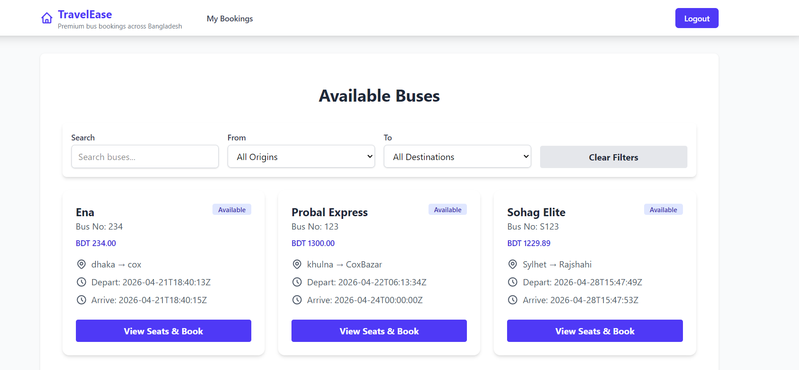

# BusTrip Backend

A Django REST API backend for booking bus seats. This project supports user registration, login with token authentication, bus management, seat booking, and viewing user bookings.




## Features

- User registration and login
- Token-based authentication using Django REST Framework
- Create and list buses
- Retrieve, update, and delete individual buses
- Book seats on a bus with seat availability checks
- List bookings for a specific user

## Requirements

- Python 3.8+
- Django
- Django REST Framework
- Django REST Framework Authtoken

## Installation

1. Clone the repository:

```bash
git clone <repo-url>
cd BusTrip
```

2. Create and activate a virtual environment:

```bash
python -m venv venv
venv\Scripts\activate
```

3. Install dependencies:

```bash
pip install -r requirement.txt
```

4. Run migrations:

```bash
python manage.py migrate
```

5. Start the development server:

```bash
python manage.py runserver
```

## API Endpoints

### Authentication

- `POST /api/register/`
  - Create a new user and return a token.
- `POST /api/login/`
  - Authenticate a user and return a token.

### Bus Endpoints

- `GET /api/buses/`
  - List all buses.
- `POST /api/buses/`
  - Create a new bus.
- `GET /api/buses/<bus_id>/`
  - Retrieve a specific bus.
- `PUT /api/buses/<bus_id>/`
  - Update a specific bus.
- `DELETE /api/buses/<bus_id>/`
  - Delete a specific bus.

### Booking Endpoints

- `POST /api/bookings/`
  - Book a seat by providing the seat ID.
- `GET /api/user/<user_id>/bookings/`
  - List bookings for the authenticated user.

## Authentication Header

For protected endpoints, include:

```http
Authorization: Token <user-auth-token>
```

## Notes

- The booking endpoint checks if a seat is already booked and returns an error if it is.
- User bookings can only be accessed by the same authenticated user.
